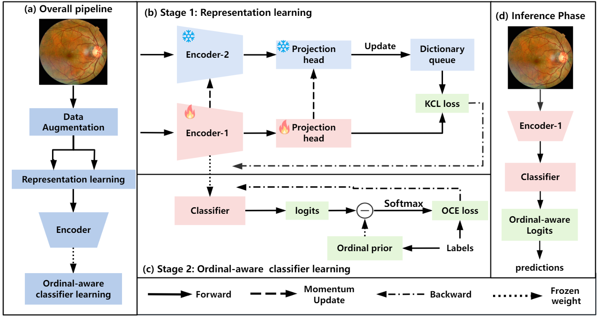
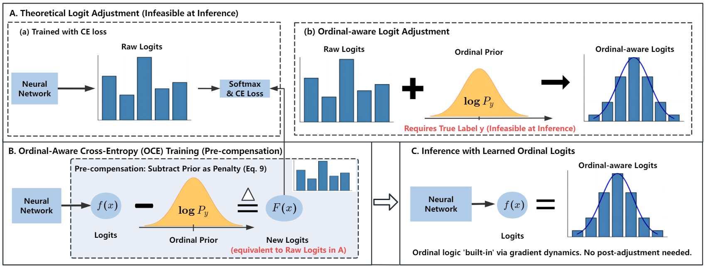

# KCOC: Ordinal-Aware Logit Adjustment and Balanced Representation Learning for Diabetic Retinopathy Grading

- This repository provides the official implementation of [*Ordinal-aware logit adjustment and balanced representation learning for diabetic retinopathy grading*](https://doi.org/10.1016/j.bspc.2026.110522), published in *Biomedical Signal Processing and Control*, Volume 123, Article 110522 (2026).

- The k-positive contrastive learning stage of KCOC builds upon our previous work, [**KMoCoL: k-Positive Momentum Contrastive Learning for Imbalanced Diabetic Retinopathy Grading**](https://doi.org/10.1109/TIM.2025.3542859), published in *IEEE Transactions on Instrumentation and Measurement*.

[](LICENSE)
[](https://doi.org/10.1016/j.bspc.2026.110522)
[](https://www.python.org/)
[](https://pytorch.org/)

## News

- **[2026/05]** The KCOC paper was published online in *Biomedical Signal Processing and Control*. [[Paper]](https://doi.org/10.1016/j.bspc.2026.110522)

KCOC is a two-stage framework for diabetic retinopathy (DR) grading. It combines k-positive contrastive representation learning with an ordinal-aware classifier to address class imbalance while modeling the ordered relationships among disease grades.



## Highlights

- **k-positive contrastive learning:** Uses a fixed number of same-grade positive samples to reduce representation bias toward majority classes.
- **Dynamic dictionary queue:** Maintains a large and continuously updated set of contrastive features independently of the mini-batch size.
- **Momentum teacher encoder:** Provides stable key representations through exponential moving average updates.
- **Ordinal-aware Cross-Entropy:** Introduces distance-aware margins between DR grades through a simple logit adjustment.
- **Efficient inference:** Discards the projection head and teacher encoder after pretraining, leaving only a standard classification backbone.
- **Multi-dataset evaluation:** Evaluated on APTOS2019, Messidor-2, and DDR with ResNet-50, DenseNet-121, and ViT-S/16 backbones.

## Method

KCOC consists of two stages.

### 1. [k-Positive Contrastive Representation Learning](https://ieeexplore.ieee.org/abstract/document/10891867)

This stage builds upon our previous work, **KMoCoL: k-Positive Momentum Contrastive Learning for Imbalanced Diabetic Retinopathy Grading**. Two augmented views of each fundus image are encoded by a query encoder and a momentum-updated key encoder. For every query, KMoCoL samples a fixed number `k` of same-class features from a dynamic queue, encouraging intra-class compactness while reducing the dominance of majority classes. KCOC uses the resulting balanced representations as the foundation for its subsequent ordinal-aware classifier training.


### 2. Ordinal-Aware Classifier Training

After contrastive pretraining, the query encoder is frozen and the projection head is replaced with a linear classifier. The classifier is then optimized using Ordinal-aware Cross-Entropy (OCE), which introduces a distance-aware logit adjustment based on the ordinal gap between the predicted and ground-truth DR grades.



By imposing larger margins on grades farther from the ground truth, OCE discourages clinically implausible distant misclassifications while preserving the ordered progression of DR severity. The hyperparameter `beta` controls the strength of the ordinal adjustment: `beta=0` reduces OCE to standard cross-entropy.

## Installation

### Prerequisites

- Python 3.9+
- A CUDA-capable GPU is recommended
- PyTorch matching the local CUDA driver

### Install Dependencies

```bash
git clone https://github.com/liluhu0/KCOC.git
cd KCOC

python -m venv .venv
source .venv/bin/activate  # Linux or macOS
# .venv\Scripts\Activate.ps1  # Windows PowerShell

pip install -r requirements.txt
```

## Citation

If you find this work useful, please cite:

```bibtex
@article{KCOC,
  title    = {Ordinal-Aware Logit Adjustment and Balanced Representation Learning for Diabetic Retinopathy Grading},
  author   = {Luhu Li and Xuya Liu and Xinguo Hou and Li Chen and Ziyu Wang and Qingfeng Ding and Shujun Fu},
  journal  = {Biomedical Signal Processing and Control},
  doi      = {10.1016/j.bspc.2026.110522},
}
@article{KMoCoL,
  title={KMoCoL: k-Positive Momentum Contrastive Learning for Imbalanced Diabetic Retinopathy Grading}, 
  author={Luhu Li and Xuya Liu and Xinguo Hou and Li Chen and Yuanfeng Zhou and Shujun Fu},
  journal={IEEE Transactions on Instrumentation and Measurement}, 
  doi={10.1109/TIM.2025.3542859}}
```

## License

This project is released under the [MIT License](LICENSE). Third-party source files retain their original copyright notices.

## Acknowledgments

This implementation builds upon the open-source PyTorch, torchvision, timm, and Momentum Contrast communities. We thank the maintainers and contributors of these projects.
